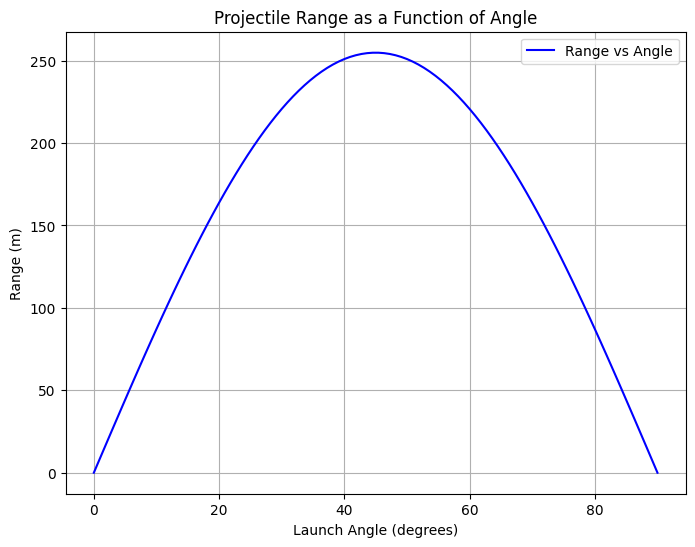
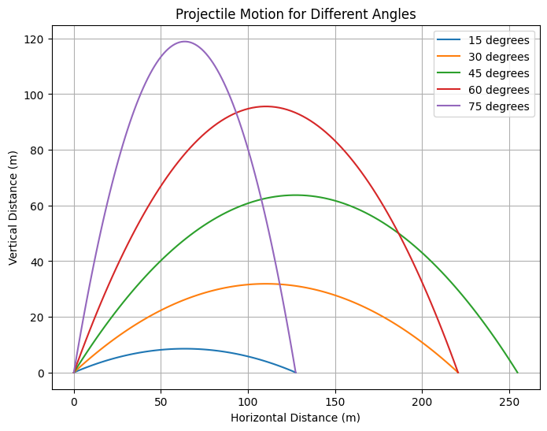

# Investigating the Range as a Function of the Angle of Projection

## Theoretical Foundation
Projectile motion follows the principles of kinematics and Newton’s laws of motion. When an object is launched with an initial velocity $v_0$ at an angle $\theta$ from the horizontal, its motion can be described by the following fundamental equations:

### Equations of Motion:
- $x = v_0 \cos(\theta) t$ (Horizontal displacement)
- $y = v_0 \sin(\theta) t - \frac{1}{2} g t^2$ (Vertical displacement)
#2
### Time of Flight:
- $$T = \frac{2 v_0 \sin(\theta)}{g}$$

### Maximum Height:
- $$H = \frac{v_0^2 \sin^2(\theta)}{2 g}$$

### Range of the Projectile:
- $$R = \frac{v_0^2 \sin(2\theta)}{g}$$

## Analysis of the Range
The range of the projectile depends on the launch angle $\theta$ and initial velocity $v_0$. The range formula indicates that the maximum range occurs at $\theta = 45^\circ$. Any deviation from this optimal angle results in a reduced range. Additionally, increasing $v_0$ leads to a greater range, while higher gravitational acceleration reduces it.

Further, using trigonometric identities, we analyze how the range is affected:
- The derivative of the range equation with respect to $\theta$ gives:
  $$ \frac{dR}{d\theta} = \frac{2 v_0^2 \cos(2\theta)}{g} $$
  Setting this to zero confirms that $\theta = 45^\circ$ maximizes the range.
- If air resistance is considered, the range formula becomes:
  $$ R = \frac{v_0^2 \sin(2\theta)}{g} e^{-\gamma T} $$
  where $\gamma$ is the drag coefficient.

## Practical Applications
Projectile motion plays a crucial role in various real-world scenarios:
- **Sports**: Calculating the trajectory of a soccer ball, basketball shot, or golf drive using physics principles.
- **Ballistics**: Understanding the motion of bullets or artillery shells to ensure accurate targeting.
- **Space Exploration**: Estimating launch angles for rockets to achieve specific orbits.
- **Engineering**: Designing bridges, dams, and structures considering projectile motion in case of falling debris.

## Implementation with Python Simulation
Below is the Python code that simulates projectile motion and visualizes the relationship between launch angle and range.

```python
import numpy as np
import matplotlib.pyplot as plt
from scipy.constants import g

# Function to compute the range of a projectile
def projectile_range(v0, theta, g=9.81):
    theta_rad = np.radians(theta)
    return (v0**2 * np.sin(2 * theta_rad)) / g

# Define parameters
v0 = 50  # Initial velocity in m/s
angles = np.linspace(0, 90, 100)  # Angle range from 0 to 90 degrees
ranges = [projectile_range(v0, theta) for theta in angles]

# Plot the range as a function of launch angle
plt.figure(figsize=(8,6))
plt.plot(angles, ranges, label='Range vs Angle', color='b')
plt.xlabel("Launch Angle (degrees)")
plt.ylabel("Range (m)")
plt.title("Projectile Range as a Function of Angle")
plt.legend()
plt.grid()
plt.show()

# Simulating projectile motion for a given angle
def projectile_trajectory(v0, theta, g=9.81):
    theta_rad = np.radians(theta)
    t_flight = (2 * v0 * np.sin(theta_rad)) / g  # Total flight time
    t = np.linspace(0, t_flight, num=100)
    x = v0 * np.cos(theta_rad) * t
    y = v0 * np.sin(theta_rad) * t - 0.5 * g * t**2
    return x, y

# Plot trajectories for different angles
plt.figure(figsize=(8,6))
for theta in [15, 30, 45, 60, 75]:
    x, y = projectile_trajectory(v0, theta)
    plt.plot(x, y, label=f'{theta} degrees')

plt.xlabel("Horizontal Distance (m)")
plt.ylabel("Vertical Distance (m)")
plt.title("Projectile Motion for Different Angles")
plt.legend()
plt.grid()
plt.show()
```



## Discussion
The simulation confirms that the projectile achieves maximum range at $\theta = 45^\circ$. This follows from the mathematical relationship $\sin(2\theta)$, which attains its maximum value at this angle. However, in real-world applications, several factors affect projectile motion:

- **Air Resistance**: Causes a reduction in range due to energy loss.
- **Altitude Variations**: Gravity is not constant everywhere on Earth.
- **Wind Effects**: Can alter the trajectory of projectiles significantly.
- **Non-Uniform Launch Surfaces**: In practical applications like sports and military applications, the ground is not always level.
- **Rotational Effects**: Spin and the Magnus effect impact sports projectiles such as baseballs and soccer balls.

## Conclusion
Projectile motion provides a strong foundation for understanding various physical phenomena. Theoretical analysis and computational simulations show how different angles influence range and trajectory. By incorporating additional factors like drag, wind, and varying gravity, more accurate models can be developed for real-world applications.
