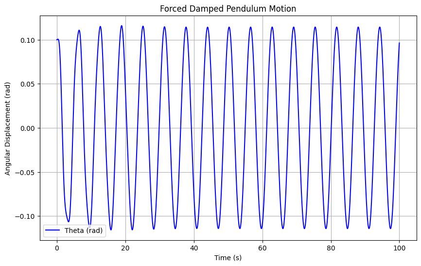
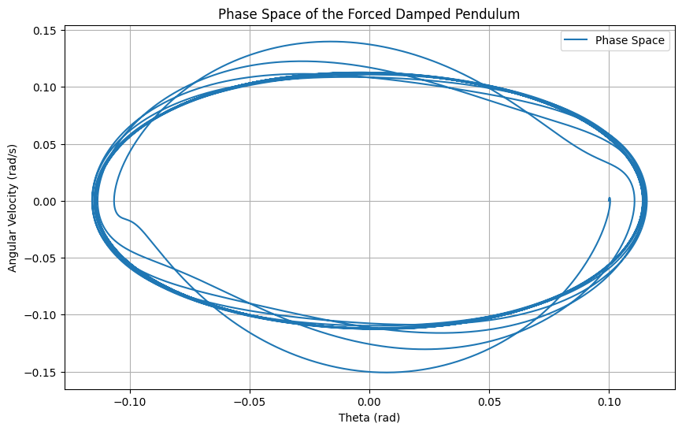

# Investigating the Dynamics of a Forced Damped Pendulum

## 1. Theoretical Foundation

The forced damped pendulum is described by the second-order nonlinear differential equation:

$$
\theta''(t) + \gamma \theta'(t) + \omega_0^2 \sin(\theta(t)) = F_0 \cos(\omega t)
$$

Where:
- \( \theta(t) \) = angular displacement as a function of time,
- \( \gamma \) = damping coefficient,
- \( \omega_0 \) = natural frequency of the undamped pendulum,
- \( F_0 \) = amplitude of the external forcing,
- \( \omega \) = driving frequency of the external force.

### For Small-Angle Oscillations:

We approximate \( \sin(\theta) \approx \theta \), leading to the linearized version of the equation:

$$
\theta''(t) + \gamma \theta'(t) + \omega_0^2 \theta(t) = F_0 \cos(\omega t)
$$

#### Resonance Condition:
At resonance, the driving frequency matches the natural frequency:

$$
\omega = \omega_0
$$

At this point, the system absorbs maximum energy from the external driving force, leading to large oscillations.

### Energy of the System:

The total mechanical energy \( E(t) \) is the sum of kinetic and potential energy:

$$
E(t) = \frac{1}{2} m L^2 \left(\theta'(t)\right)^2 + \frac{1}{2} m g L (1 - \cos(\theta(t)))
$$

Where:
- \( m \) = mass of the pendulum,
- \( L \) = length of the pendulum,
- \( g \) = gravitational acceleration.

---

## 2. Analysis of Dynamics

### Influence of Damping Coefficient \( \gamma \):
- **Underdamped**: When \( \gamma < 2\sqrt{m \omega_0} \), the pendulum oscillates with decreasing amplitude.
- **Overdamped**: When \( \gamma > 2\sqrt{m \omega_0} \), the pendulum returns slowly to equilibrium without oscillating.

### Effect of Driving Amplitude and Frequency:
- Increasing the **driving amplitude** \( F_0 \) leads to larger oscillations.
- The **driving frequency** \( \omega \) affects how the system absorbs energy, and when \( \omega = \omega_0 \), the system resonates, leading to large oscillations.

### Transition to Chaotic Motion:
When the damping or frequency deviates from the resonance point, the system can exhibit chaotic behavior. This is often seen when varying the driving frequency slightly off resonance, leading to **quasiperiodic** and **chaotic motion**.

---

## 3. Practical Applications

The forced damped pendulum model applies to various real-world systems, such as:
1. **Energy Harvesting Devices**: These systems convert mechanical vibrations into electrical energy by exploiting resonance.
2. **Suspension Bridges**: Bridges experience periodic forces (e.g., from wind or traffic), and understanding resonance helps in designing structures that avoid catastrophic oscillations.
3. **Oscillating Circuits**: The behavior of driven RLC circuits can be modeled similarly to a forced damped pendulum, where resonance is crucial for efficient energy transfer.

---

## 4. Implementation

### Python Code for Simulation

Below is the Python code to simulate the motion of the forced damped pendulum using **Runge-Kutta** methods and visualize the motion for various conditions.

```python
import numpy as np
import matplotlib.pyplot as plt
from scipy.integrate import solve_ivp

# Parameters
m = 1.0  # mass of the pendulum (kg)
L = 1.0  # length of the pendulum (m)
g = 9.8  # acceleration due to gravity (m/s^2)
gamma = 0.2  # damping coefficient
omega_0 = np.sqrt(g / L)  # natural frequency (rad/s)
F_0 = 1.0  # amplitude of driving force
omega = 1.0  # driving frequency

# Define the system of ODEs
def pendulum(t, y):
    theta, omega_theta = y
    dydt = [omega_theta, -gamma * omega_theta - (g / L) * np.sin(theta) + F_0 * np.cos(omega * t)]
    return dydt

# Initial conditions
theta0 = 0.1  # initial angle (rad)
omega_theta0 = 0.0  # initial angular velocity (rad/s)

# Time span for the solution
t_span = (0, 100)
t_eval = np.linspace(0, 100, 10000)

# Solve the ODE
sol = solve_ivp(pendulum, t_span, [theta0, omega_theta0], t_eval=t_eval)

# Plot the results
plt.figure(figsize=(10, 6))
plt.plot(sol.t, sol.y[0], label='Theta (rad)', color='b')
plt.title('Forced Damped Pendulum Motion')
plt.xlabel('Time (s)')
plt.ylabel('Angular Displacement (rad)')
plt.grid(True)
plt.legend()
plt.show()

# Plot phase diagram
plt.figure(figsize=(10, 6))
plt.plot(sol.y[0], sol.y[1], label='Phase Space')
plt.title('Phase Space of the Forced Damped Pendulum')
plt.xlabel('Theta (rad)')
plt.ylabel('Angular Velocity (rad/s)')
plt.grid(True)
plt.legend()
plt.show()




# 5. Discussion

### Damping Effects
The damping coefficient \( \gamma \) has a significant effect on the pendulum's behavior. When the damping is small (underdamped system), the pendulum oscillates, but the amplitude gradually decreases over time. As the damping coefficient increases, the system's oscillations are damped out more quickly, and if \( \gamma \) becomes very large (overdamped system), the pendulum will not oscillate at all but will slowly return to its equilibrium position. In the case of moderate damping, the system will exhibit damped oscillations, where the amplitude decreases but the system still oscillates for a period.

For the forced damped pendulum, a critical point occurs when the damping coefficient approaches a value that corresponds to the natural frequency. At this point, the system may behave in a more predictable way, or exhibit chaos under certain conditions.

### Resonance and Energy Transfer
Resonance occurs when the driving frequency \( \omega \) matches the natural frequency \( \omega_0 \) of the system. At this point, the pendulum will absorb maximum energy from the external driving force, leading to large oscillations. If the system remains underdamped, the oscillations will grow in amplitude, potentially causing large swings in the pendulum, while in the overdamped case, the oscillations will decrease rapidly, and the system will return to equilibrium more quickly.

Resonance is a key phenomenon in many real-world applications. In energy harvesting devices, resonance is used to maximize the energy transfer from mechanical vibrations to electrical energy. In suspension bridges, resonance at certain frequencies must be avoided to prevent excessive oscillations.

### Chaotic Motion and Transition to Chaos
When the driving force is applied at a frequency that is slightly detuned from the system's natural frequency, or when other parameters like damping and amplitude are adjusted, the forced damped pendulum may exhibit **chaotic motion**. This is particularly evident in the **phase space** diagrams, where regular periodic behavior gives way to a more complex, unpredictable motion. The system's trajectory in phase space becomes increasingly erratic as it moves away from the fixed point, showing sensitivity to initial conditions—a hallmark of chaotic systems.

The transition from regular oscillations to chaotic motion can be illustrated using **Poincaré sections** and **bifurcation diagrams**. These diagrams are particularly useful in understanding how small changes in parameters (such as driving frequency or damping) can lead to significant changes in the system's behavior.

---

# 6. Conclusion

The forced damped pendulum provides an excellent example of how physical systems with both damping and periodic forcing can exhibit a wide range of behaviors, from regular oscillations to complex chaotic dynamics. Through the use of numerical simulations, we can visualize and better understand the system's behavior across different regimes of damping, driving amplitude, and frequency.

- **Damping**: The system moves from underdamped (where the pendulum oscillates with decreasing amplitude) to overdamped (where the pendulum slowly returns to equilibrium without oscillating) as the damping coefficient increases.
- **Resonance**: At resonance, the pendulum absorbs maximum energy from the driving force, leading to large oscillations.
- **Chaotic Behavior**: As the driving frequency or damping coefficient is varied, the pendulum may transition from periodic to chaotic motion, which can be studied through phase portraits, Poincaré sections, and bifurcation diagrams.

This task highlights the importance of resonance and chaos in both physics and engineering, providing insights into energy harvesting, structural design, and mechanical resonance. The model can be extended to more complex systems by introducing nonlinear damping, non-periodic driving forces, or other real-world constraints such as air resistance.

By experimenting with the damping coefficient, driving frequency, and amplitude, we can better understand how these parameters affect the system's dynamics, and apply this knowledge to optimize real-world systems like oscillating circuits, suspension bridges, and energy harvesting devices.

---

