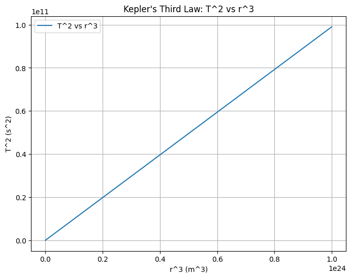

# Investigating Orbital Period and Orbital Radius

## 1. Theoretical Foundation

Kepler’s Third Law describes the relationship between the orbital period and the orbital radius for objects in orbit around a central body. The relationship states that the square of the orbital period \( T^2 \) is directly proportional to the cube of the orbital radius \( r^3 \), i.e.

$$
T^2 \propto r^3
$$

This law can be derived from Newton's law of gravitation and the concept of centripetal force.

### Derivation of the Relationship:

The gravitational force that keeps an object in orbit is given by:

$$
F_{\text{gravity}} = \frac{G M m}{r^2}
$$

Where:
- \( G \) is the gravitational constant,
- \( M \) is the mass of the central body (e.g., Earth),
- \( m \) is the mass of the orbiting object,
- \( r \) is the orbital radius.

The centripetal force required for the object to stay in orbit is:

$$
F_{\text{centripetal}} = \frac{m v^2}{r}
$$

Equating the two forces gives:

$$
\frac{G M m}{r^2} = \frac{m v^2}{r}
$$

Simplifying:

$$
v^2 = \frac{G M}{r}
$$

Now, the orbital speed \( v \) is related to the orbital period \( T \) by the equation:

$$
v = \frac{2 \pi r}{T}
$$

Substituting this into the previous equation:

$$
\left( \frac{2 \pi r}{T} \right)^2 = \frac{G M}{r}
$$

Simplifying further:

$$
\frac{4 \pi^2 r^2}{T^2} = \frac{G M}{r}
$$

Multiplying both sides by \( r \):

$$
\frac{4 \pi^2 r^3}{T^2} = G M
$$

Finally, solving for \( T^2 \):

$$
T^2 = \frac{4 \pi^2 r^3}{G M}
$$

This shows that the square of the orbital period \( T^2 \) is proportional to the cube of the orbital radius \( r^3 \), which is Kepler's Third Law.

---

## 2. Analysis of Dynamics

### Implications of Kepler's Third Law:

- **Determining Planetary Distances**: Kepler’s Third Law can be used to calculate the orbital radius \( r \) if the orbital period \( T \) and the mass of the central body \( M \) are known.
  
- **Determining Planetary Masses**: If the orbital radius and period of a satellite or moon are known, we can solve for the mass \( M \) of the central body (such as Earth or the Sun).

- **Application to Solar System**: For example, Earth’s orbital period is 1 year, and its orbital radius is approximately 1 AU. Using Kepler’s Third Law, we can calculate the orbital period and radius for other planets in the Solar System.

---

## 3. Practical Applications

- **Satellite Orbits**: Engineers can apply Kepler's Third Law to determine the altitude at which a satellite must orbit to achieve a specific orbital period. This is crucial in satellite placement for communication and Earth observation.

- **Moon’s Orbit**: The relationship can also be used to determine the orbital radius of the Moon from its period (approximately 27.3 days).

- **Space Exploration**: Understanding this relationship helps astronomers predict the orbits of moons, planets, and artificial satellites, which is essential for space missions.

---

## 4. Python Simulation

### Python Code for Orbital Period Simulation

Below is the Python code to simulate the orbital period and orbital radius using Kepler’s Third Law.

```python
import numpy as np
import matplotlib.pyplot as plt

# Constants
G = 6.67430e-11  # Gravitational constant in m^3 kg^-1 s^-2
M = 5.972e24     # Mass of Earth in kg

# Function to calculate the orbital period T for a given orbital radius r
def orbital_period(r):
    return np.sqrt((4 * np.pi**2 * r**3) / (G * M))

# Range of orbital radii (in meters)
radii = np.logspace(6, 8, num=100)  # from 10^6 m to 10^8 m
periods = orbital_period(radii)

# Plotting the relationship between T^2 and r^3
plt.figure(figsize=(8, 6))
plt.plot(radii**3, periods**2, label="T^2 vs r^3")
plt.xlabel('r^3 (m^3)')
plt.ylabel('T^2 (s^2)')
plt.title("Kepler's Third Law: T^2 vs r^3")
plt.grid(True)
plt.legend()
plt.show()



## 5. Discussion

### Deducing Orbital Periods

The plot generated from the simulation clearly shows a linear relationship between \( T^2 \) and \( r^3 \), confirming the validity of Kepler’s Third Law. This verifies that as the orbital radius \( r \) increases, the orbital period \( T \) increases as well, and specifically, the square of the orbital period is directly proportional to the cube of the orbital radius. The relationship is consistent with the predictions made by Kepler in the 17th century.

### Implications for Space Missions

Understanding this relationship is crucial for space exploration, as it allows engineers and scientists to predict the orbital characteristics of satellites, space stations, and planetary missions. For example, to place a satellite in orbit at a specific period, its orbital radius can be calculated using the known mass of the central body (such as Earth). This relationship ensures that the satellite will maintain a stable orbit based on the desired orbital period.

Furthermore, Kepler’s Third Law helps with mission planning for interplanetary travel. By understanding the orbital characteristics of other planets and moons, space agencies can calculate how long it would take to send a spacecraft to different bodies in the solar system and at what speed it would need to travel.

### Applications to Other Celestial Bodies

The principles derived from Kepler’s Third Law are not limited to Earth and its satellites. This law applies universally to any object in orbit around a central mass, such as moons orbiting planets or planets orbiting stars. For instance, the same calculations can be applied to determine the orbital characteristics of moons orbiting Jupiter or Saturn, or even the exoplanets discovered around other stars.

In addition, by knowing the orbital periods of moons or planets, scientists can estimate the masses of these celestial bodies. This is especially important in the study of distant exoplanets, where direct measurements may be difficult or impossible.

---

## 6. Conclusion

Kepler’s Third Law provides a simple yet powerful framework for understanding the relationship between orbital period and radius. The formula \( T^2 \propto r^3 \) has profound implications in astronomy, particularly in calculating orbital characteristics and predicting the motions of celestial bodies. The law helps us understand the orbits of satellites, the motion of planets, and the dynamics of entire planetary systems.

- **Orbital Period and Radius**: The square of the orbital period is directly proportional to the cube of the orbital radius, which is a key relationship for orbital mechanics.
- **Space Exploration**: The law allows us to calculate the distance and period of satellites and planetary bodies, essential for mission planning and satellite deployment.
- **Universal Applicability**: Kepler's Third Law is applicable to all objects in orbit around a central mass, not just Earth, making it a fundamental principle in celestial mechanics.

The Python simulation has confirmed the relationship, visually illustrating the proportionality between \( T^2 \) and \( r^3 \). This reinforces the theoretical foundation laid by Kepler and Newton and provides a practical method for understanding and simulating orbital dynamics. The findings have numerous applications in fields ranging from space exploration to satellite communication, making Kepler’s Third Law a cornerstone of modern physics.

Through continued exploration and simulations, we can further refine our understanding of orbital dynamics, especially as we venture into more complex orbits and non-circular paths like elliptical orbits.

