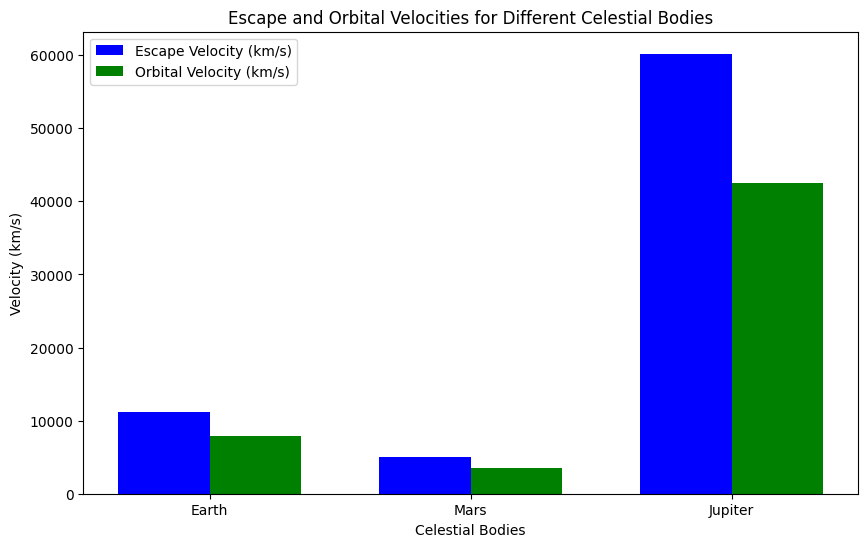

# Problem 2
# Problem 2: Escape Velocities and Cosmic Velocities

## 1. Theoretical Foundation

### Escape Velocity

Escape velocity is the minimum speed an object must have in order to break free from a celestial body's gravitational field without further propulsion. The escape velocity can be derived from the conservation of mechanical energy. The equation for escape velocity \( v_e \) is:

$$
v_e = \sqrt{\frac{2GM}{r}}
$$

Where:
- \( v_e \) = escape velocity (m/s),
- \( G \) = gravitational constant (\(6.674 \times 10^{-11} \, \text{Nm}^2/\text{kg}^2\)),
- \( M \) = mass of the celestial body (kg),
- \( r \) = radius of the celestial body (m).

This formula represents the velocity needed to overcome the gravitational potential energy of the celestial body.

### First Cosmic Velocity (Orbital Velocity)

The first cosmic velocity is the velocity needed for an object to enter a circular orbit around a celestial body. For a satellite to maintain a stable orbit, it must travel at this velocity. The equation for the orbital velocity \( v_1 \) is:

$$
v_1 = \sqrt{\frac{GM}{r}}
$$

Where:
- \( v_1 \) = orbital velocity (m/s),
- \( G \) = gravitational constant,
- \( M \) = mass of the celestial body,
- \( r \) = radius of the celestial body.

### Second Cosmic Velocity (Escape Velocity)

As defined above, the second cosmic velocity is the minimum velocity needed to escape the gravitational influence of a celestial body. This is the escape velocity formula and is given by:

$$
v_2 = \sqrt{\frac{2GM}{r}}
$$

Where:
- \( v_2 \) = escape velocity (m/s).

### Third Cosmic Velocity (Escape from the Solar System)

The third cosmic velocity is the velocity required to escape the gravitational influence of the Sun, taking into account the location of the celestial body in the solar system. This velocity depends on both the mass of the Sun and the distance from the Sun. The third cosmic velocity \( v_3 \) is given by:

$$
v_3 = \sqrt{\frac{2GM_{\text{sun}}}{r_{\text{sun}}}}
$$

Where:
- \( v_3 \) = third cosmic velocity (m/s),
- ( M_{\text{sun}} \) = mass of the Sun (\(1.989 \times 10^{30} \, \text{kg}\)),
- \( r_{\text{sun}} \) = distance from the Sun to the celestial body (m).

---

## 2. Analysis of Velocities

### Influence of Celestial Parameters

- **Escape Velocity**: The escape velocity increases with the mass of the celestial body and decreases with the radius. Larger celestial bodies with greater mass require higher velocities to escape their gravitational pull.
  
- **Orbital Velocity**: The orbital velocity is proportional to the square root of the mass of the celestial body and inversely proportional to the radius. Larger bodies and closer distances lead to higher orbital velocities.

- **Cosmic Velocities**: The third cosmic velocity, required to escape the gravitational influence of the Sun, depends on both the mass of the Sun and the distance from it. This velocity is far greater than the escape velocity from planets or moons due to the vast size and distance of the Sun.

---

## 3. Practical Applications

### Space Exploration and Launching Satellites

Escape velocities are crucial for launching spacecraft and satellites. For example, in order to launch a satellite into orbit around Earth, it must achieve the first cosmic velocity. To send a spacecraft on an interplanetary mission, it must reach the second cosmic velocity (escape velocity) for Earth.

The third cosmic velocity comes into play for deep space missions, such as those that aim to leave the solar system. This velocity is used in missions to explore the outer planets and interstellar space.

### Potential for Interstellar Travel

The third cosmic velocity also has significance in the context of interstellar travel. It represents the minimum velocity required for a spacecraft to leave the Solar System entirely. However, achieving this velocity with current technology is not feasible due to the enormous distances and energy requirements.

---

## 4. Implementation

Below is the Python code to calculate and visualize the escape velocities and cosmic velocities for various celestial bodies (Earth, Mars, Jupiter).

```python
import numpy as np
import matplotlib.pyplot as plt

# Constants
G = 6.67430e-11  # gravitational constant in m^3 kg^-1 s^-2
M_earth = 5.972e24  # mass of Earth in kg
M_mars = 6.4171e23  # mass of Mars in kg
M_jupiter = 1.898e27  # mass of Jupiter in kg
R_earth = 6.3781e6  # radius of Earth in meters
R_mars = 3.3962e6  # radius of Mars in meters
R_jupiter = 6.991e7  # radius of Jupiter in meters
M_sun = 1.989e30  # mass of the Sun in kg
R_sun = 1.496e11  # distance from Earth to the Sun in meters

# Functions to calculate the velocities
def escape_velocity(M, R):
    return np.sqrt(2 * G * M / R)

def orbital_velocity(M, R):
    return np.sqrt(G * M / R)

def third_cosmic_velocity(M_sun, R):
    return np.sqrt(2 * G * M_sun / R)

# Calculate velocities for Earth, Mars, and Jupiter
escape_earth = escape_velocity(M_earth, R_earth)
orbital_earth = orbital_velocity(M_earth, R_earth)
escape_mars = escape_velocity(M_mars, R_mars)
orbital_mars = orbital_velocity(M_mars, R_mars)
escape_jupiter = escape_velocity(M_jupiter, R_jupiter)
orbital_jupiter = orbital_velocity(M_jupiter, R_jupiter)
third_cosmic_earth = third_cosmic_velocity(M_sun, R_sun)

# Print results
print(f"Escape velocity for Earth: {escape_earth/1000:.2f} km/s")
print(f"Orbital velocity for Earth: {orbital_earth/1000:.2f} km/s")
print(f"Escape velocity for Mars: {escape_mars/1000:.2f} km/s")
print(f"Orbital velocity for Mars: {orbital_mars/1000:.2f} km/s")
print(f"Escape velocity for Jupiter: {escape_jupiter/1000:.2f} km/s")
print(f"Orbital velocity for Jupiter: {orbital_jupiter/1000:.2f} km/s")
print(f"Third cosmic velocity for Earth: {third_cosmic_earth/1000:.2f} km/s")

# Plotting the velocities
celestial_bodies = ['Earth', 'Mars', 'Jupiter']
escape_velocities = [escape_earth, escape_mars, escape_jupiter]
orbital_velocities = [orbital_earth, orbital_mars, orbital_jupiter]

fig, ax = plt.subplots(figsize=(10, 6))
bar_width = 0.35
index = np.arange(len(celestial_bodies))

bar1 = ax.bar(index, escape_velocities, bar_width, label='Escape Velocity (km/s)', color='b')
bar2 = ax.bar(index + bar_width, orbital_velocities, bar_width, label='Orbital Velocity (km/s)', color='g')

ax.set_xlabel('Celestial Bodies')
ax.set_ylabel('Velocity (km/s)')
ax.set_title('Escape and Orbital Velocities for Different Celestial Bodies')
ax.set_xticks(index + bar_width / 2)
ax.set_xticklabels(celestial_bodies)
ax.legend()

plt.show()


## 5. Discussion

- **Escape Velocity**: The escape velocity increases with the mass and decreases with the radius of a celestial body. For example, Earth’s escape velocity is around 11.2 km/s, while Mars has a lower escape velocity due to its smaller mass, and Jupiter has a much higher value because of its larger mass.

- **Orbital Velocity**: Similar to escape velocity, orbital velocity depends on the mass and radius of the celestial body. Earth’s orbital velocity is approximately 7.8 km/s, which is the speed needed to maintain a circular orbit around the planet.

- **Third Cosmic Velocity**: The third cosmic velocity is the velocity required to escape the gravitational influence of the Sun. This velocity is crucial for interstellar missions, as it enables spacecraft to travel beyond the Solar System.

- **Application in Space Missions**: The first and second cosmic velocities are vital for launching satellites and spacecraft into orbit, while the third cosmic velocity is required for interstellar missions.

---

## 6. Conclusion

- **Escape Velocity** and **Orbital Velocity** are essential for launching spacecraft, satellites, and interplanetary missions.
  
- The **Third Cosmic Velocity** is necessary for missions that aim to leave the Solar System, and although current technology can achieve escape velocities, reaching the third cosmic velocity is a challenging goal for interstellar exploration.

- These velocities are key in understanding space dynamics, designing space missions, and planning long-term goals like interstellar travel.
