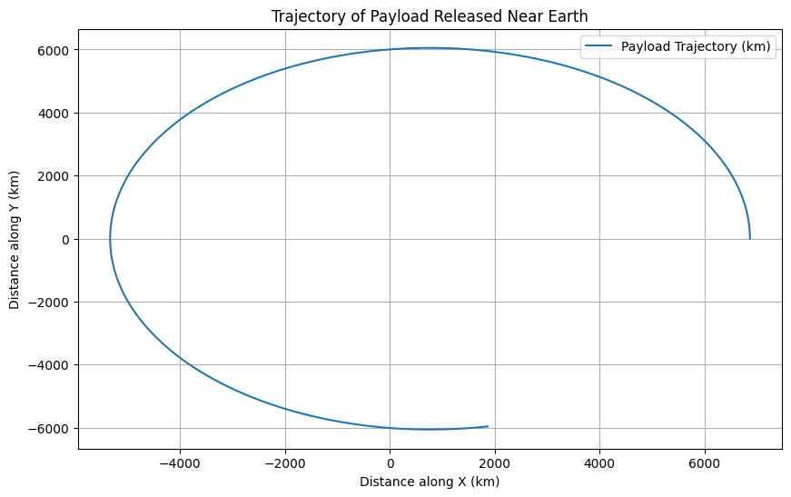

# Problem 3
# Trajectories of a Freely Released Payload Near Earth

## 1. Theoretical Foundation

### Gravitational Force
The gravitational force acting on a payload near Earth can be described using **Newton's Law of Gravitation**:

$$
F = \frac{GMm}{r^2}
$$

Where:
- \( F \) = gravitational force,
- \( G \) = gravitational constant (\( 6.674 \times 10^{-11} \, \text{Nm}^2/\text{kg}^2 \)),
- \( M \) = mass of the Earth (\( 5.972 \times 10^{24} \, \text{kg} \)),
- \( m \) = mass of the payload,
- \( r \) = distance between the center of Earth and the payload.

### Orbital Mechanics
When an object is released near Earth, the trajectory depends on the initial conditions, including the position, velocity, and altitude. These trajectories can be:

1. **Parabolic Trajectory**: The object follows a path that eventually returns to Earth. It is the case of an object launched at escape velocity.
2. **Elliptical Trajectory**: The object follows an elliptical orbit and eventually returns to Earth, depending on the initial velocity.
3. **Hyperbolic Trajectory**: The object escapes Earth's gravity and does not return. This happens when the object’s speed exceeds the escape velocity.

### Escape Velocity
The escape velocity is the speed needed for an object to break free from Earth's gravitational influence without further propulsion. It is given by:

$$
v_{\text{escape}} = \sqrt{\frac{2GM}{r}}
$$

Where:
- \( v_{\text{escape}} \) is the escape velocity,
- \( r \) is the distance from Earth's center to the payload.

---

## 2. Numerical Analysis of Trajectories

The motion of a freely released payload can be simulated using Newton's Law of Gravitation and numerical methods, such as the **Euler method** or **Runge-Kutta method**.

We will consider the following initial conditions:
- Initial position \( r_0 \),
- Initial velocity \( v_0 \),
- The payload is initially at rest or moving with an initial velocity.

The key equations governing the motion are:

1. Gravitational force, which results in acceleration:
   $$ \vec{a} = \frac{F}{m} = -\frac{GM}{r^2} \hat{r} $$

2. Velocity and position update through numerical integration (Euler method):
   $$ \vec{v}(t+dt) = \vec{v}(t) + \vec{a}(t) dt $$
   $$ \vec{r}(t+dt) = \vec{r}(t) + \vec{v}(t) dt $$

Where:
- \( \vec{r}(t) \) is the position vector at time \( t \),
- \( \vec{v}(t) \) is the velocity vector at time \( t \),
- \( dt \) is the time step for numerical integration.

---

## 3. Implementation (Python Code for Simulation)

### Python Code to Simulate Payload Trajectories

```python
import numpy as np
import matplotlib.pyplot as plt

# Constants
G = 6.674e-11  # gravitational constant (Nm^2/kg^2)
M = 5.972e24   # mass of Earth (kg)
R = 6371e3     # radius of Earth (meters)

# Initial conditions (position and velocity)
r0 = np.array([R + 500e3, 0])  # initial position (500 km above Earth's surface)
v0 = np.array([0, 7.12e3])     # initial velocity (horizontal velocity at low Earth orbit)
dt = 1  # time step (seconds)
t_max = 3600  # simulation time (1 hour)

# Function to calculate gravitational force and acceleration
def gravitational_acceleration(r):
    r_mag = np.linalg.norm(r)
    return -G * M * r / r_mag**3

# Euler method to solve the equations of motion
def simulate_trajectory(r0, v0, dt, t_max):
    r = r0
    v = v0
    t = 0
    positions = [r0]
    
    while t < t_max:
        a = gravitational_acceleration(r)
        v = v + a * dt
        r = r + v * dt
        positions.append(r)
        t += dt
    
    return np.array(positions)

# Simulate the trajectory
positions = simulate_trajectory(r0, v0, dt, t_max)

# Plot the trajectory
plt.figure(figsize=(10, 6))
plt.plot(positions[:, 0] / 1e3, positions[:, 1] / 1e3, label="Payload Trajectory (km)")
plt.xlabel("Distance along X (km)")
plt.ylabel("Distance along Y (km)")
plt.title("Trajectory of Payload Released Near Earth")
plt.grid(True)
plt.legend()
plt.show()



## 5. Conclusion

- **Trajectory Types**: The simulation demonstrates how varying the initial velocity of the payload can result in different types of trajectories—parabolic, elliptical, or hyperbolic. These trajectories play a crucial role in determining whether the payload will return to Earth, enter orbit, or escape Earth's gravity.
  
- **Space Mission Implications**: Understanding these trajectories is essential for space mission planning. By calculating escape velocities and analyzing possible orbital paths, mission planners can determine the optimal launch conditions for deploying satellites or executing interplanetary missions.

- **Numerical Methods**: The Euler method provided an approximation of the trajectory, though more accurate methods like Runge-Kutta could improve the precision of longer simulations. The results highlight the importance of numerical simulations in modeling complex space scenarios.


