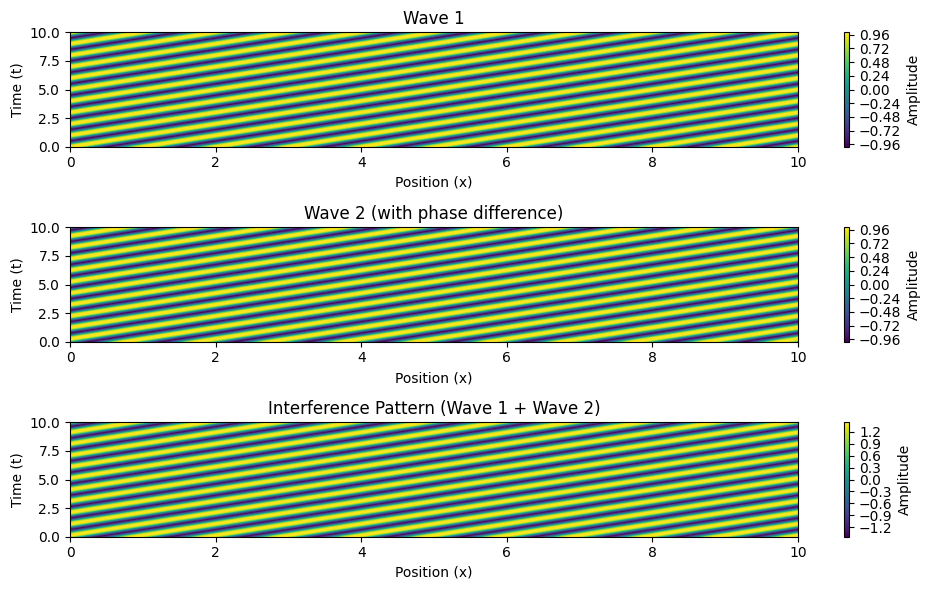
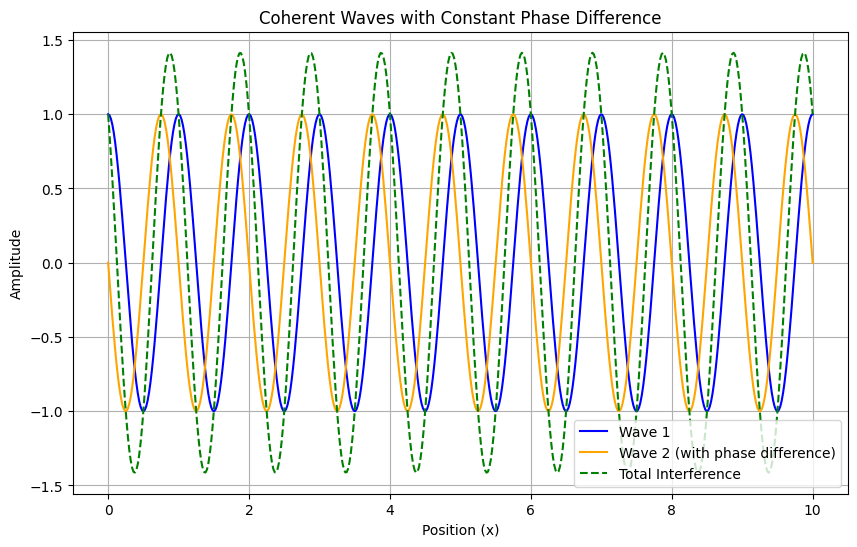
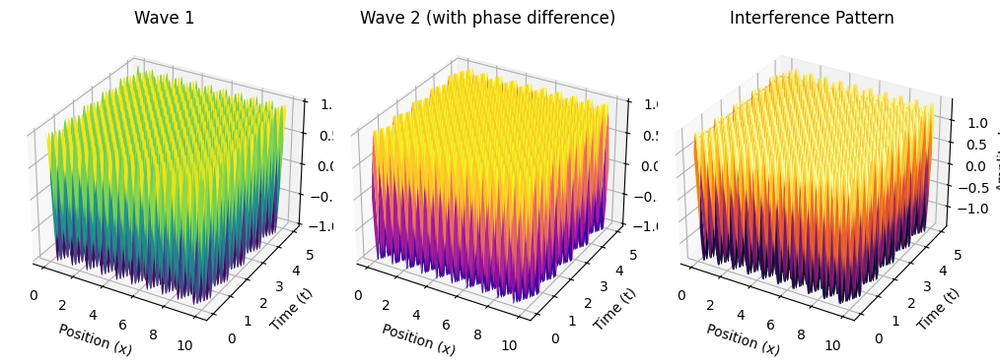

# Problem 1
# Interference Patterns on a Water Surface

## Motivation
Interference occurs when waves from different sources overlap, creating new patterns. On a water surface, this can be easily observed when ripples from different points meet, forming distinctive interference patterns. These patterns help us understand wave behavior, such as constructive and destructive interference, in a simple, visual way. 


## Theoretical Background
### Single Disturbance Wave Equation
A circular wave on the water surface from a point source located at $$(x_0, y_0)$$ can be described by:
$$
\psi (x, y, t) = A \cos (k r - \omega t + \phi)
$$
where:
 - $$\psi(x, y, t)$$ 
 is the displacement at position - $$(x, y)$$ and time $$t$$.
- $$A$$ 
is the amplitude.
- $$k = \frac{2\pi}{\lambda}$$ 
is the wave number.
- $$\omega = 2\pi f$$ 
is the angular frequency.
- $$r = \sqrt{(x - x_0)^2 + (y - y_0)^2}$$
 is the distance from the source.
- $$\phi$$
 is the initial phase.

### Superposition Principle
When multiple wave sources exist, the total displacement is:
$$
\Psi (x, y, t) = \sum_{i=1}^{N} A_i \cos (k r_i - \omega t + \phi_i)
$$
where $$N$$ is the number of sources.


## Computational Model and Visualization

The Python script below simulates and visualizes interference patterns for waves originating from multiple point sources placed at the vertices of a regular polygon.

```python
import numpy as np
import matplotlib.pyplot as plt

# Define wave parameters
A = 1  # Amplitude
lambda_ = 1  # Wavelength
k = 2 * np.pi / lambda_  # Wave number
omega = 2 * np.pi  # Angular frequency
N = 4  # Number of sources (square)

# Define grid
x = np.linspace(-5, 5, 400)
y = np.linspace(-5, 5, 400)
X, Y = np.meshgrid(x, y)

# Define source positions for a square
sources = [(-2, -2), (2, -2), (2, 2), (-2, 2)]

def wave(x0, y0):
    r = np.sqrt((X - x0) ** 2 + (Y - y0) ** 2)
    return A * np.cos(k * r)

# Compute superposition of waves
total_wave = sum(wave(x0, y0) for x0, y0 in sources)

# Plot the interference pattern
plt.figure(figsize=(8, 6))
plt.contourf(X, Y, total_wave, levels=50, cmap='coolwarm')
plt.colorbar(label='Wave Amplitude')
plt.title('Interference Pattern of Waves from a Square Configuration')
plt.xlabel('x')
plt.ylabel('y')
plt.show()
```


```python
import numpy as np
import matplotlib.pyplot as plt

# Define planetary data (AU and years)
planets = ['Mercury', 'Venus', 'Earth', 'Mars', 'Jupiter', 'Saturn', 'Uranus', 'Neptune']
orbit_radii = np.array([0.39, 0.72, 1.00, 1.52, 5.20, 9.58, 19.22, 30.05])  # AU
orbital_periods = np.array([0.24, 0.62, 1.00, 1.88, 11.86, 29.46, 84.01, 164.79])  # Years

# Verify T^2 vs r^3 relationship
T_squared = orbital_periods ** 2
r_cubed = orbit_radii ** 3

# Plotting
plt.figure(figsize=(8,6))
plt.plot(r_cubed, T_squared, 'ro', label="Planetary Data")
plt.xlabel("Orbital Radius Cubed (AU^3)")
plt.ylabel("Orbital Period Squared (Years^2)")
plt.title("Verification of Kepler's Third Law")
plt.legend()
plt.grid()
plt.show()
```


```python
import numpy as np
import matplotlib.pyplot as plt

# Define wave parameters
A = 1  # Amplitude
lambda_ = 1  # Wavelength
k = 2 * np.pi / lambda_  # Wave number
omega = 2 * np.pi  # Angular frequency
phase_difference = np.pi / 2  # Phase difference (constant)

# Define time and space grid
t = np.linspace(0, 10, 500)  # Time from 0 to 10 seconds
x = np.linspace(0, 10, 500)  # Space from 0 to 10 meters
X, T = np.meshgrid(x, t)

# Define the two waves
wave1 = A * np.cos(k * X - omega * T)  # First wave
wave2 = A * np.cos(k * X - omega * T + phase_difference)  # Second wave with phase difference

# Total displacement from the superposition of waves
total_wave = wave1 + wave2

# Plotting the waves and their interference
plt.figure(figsize=(10, 6))

# Plot the first wave
plt.subplot(3, 1, 1)
plt.title("Wave 1")
plt.contourf(X, T, wave1, levels=50, cmap='viridis')
plt.colorbar(label='Amplitude')
plt.xlabel('Position (x)')
plt.ylabel('Time (t)')

# Plot the second wave
plt.subplot(3, 1, 2)
plt.title("Wave 2 (with phase difference)")
plt.contourf(X, T, wave2, levels=50, cmap='viridis')
plt.colorbar(label='Amplitude')
plt.xlabel('Position (x)')
plt.ylabel('Time (t)')

# Plot the total interference pattern
plt.subplot(3, 1, 3)
plt.title("Interference Pattern (Wave 1 + Wave 2)")
plt.contourf(X, T, total_wave, levels=50, cmap='viridis')
plt.colorbar(label='Amplitude')
plt.xlabel('Position (x)')
plt.ylabel('Time (t)')

plt.tight_layout()
plt.show()

```



```python
import numpy as np
import matplotlib.pyplot as plt

# Define wave parameters
A = 1  # Amplitude
lambda_ = 1  # Wavelength
k = 2 * np.pi / lambda_  # Wave number
omega = 2 * np.pi  # Angular frequency
phase_difference = np.pi / 2  # Phase difference (constant)

# Define space and time grid
x = np.linspace(0, 10, 500)  # Space from 0 to 10 meters
t = 5  # Time point to plot the waves

# Define the two waves
wave1 = A * np.cos(k * x - omega * t)  # First wave
wave2 = A * np.cos(k * x - omega * t + phase_difference)  # Second wave with phase difference

# Total displacement from the superposition of waves
total_wave = wave1 + wave2

# Plotting the waves
plt.figure(figsize=(10, 6))

# Plot the first wave
plt.plot(x, wave1, label="Wave 1", color='blue')

# Plot the second wave
plt.plot(x, wave2, label="Wave 2 (with phase difference)", color='orange')

# Plot the total interference pattern
plt.plot(x, total_wave, label="Total Interference", color='green', linestyle='--')

# Adding labels and title
plt.title("Coherent Waves with Constant Phase Difference")
plt.xlabel("Position (x)")
plt.ylabel("Amplitude")
plt.legend()

# Show the plot
plt.grid(True)
plt.show()
```



```python
import numpy as np
import matplotlib.pyplot as plt

# Define wave parameters
A = 1  # Amplitude
lambda_ = 1  # Wavelength
k = 2 * np.pi / lambda_  # Wave number
omega = 2 * np.pi  # Angular frequency
phase_difference = np.pi / 2  # Phase difference (constant)

# Define space and time grid
x = np.linspace(0, 10, 500)  # Space from 0 to 10 meters
t = np.linspace(0, 5, 500)  # Time from 0 to 5 seconds

# Create meshgrid for space and time
X, T = np.meshgrid(x, t)

# Define the two waves
wave1 = A * np.cos(k * X - omega * T)  # First wave
wave2 = A * np.cos(k * X - omega * T + phase_difference)  # Second wave with phase difference

# Total displacement from the superposition of waves
total_wave = wave1 + wave2

# Plotting the waves in a 3D surface plot
fig = plt.figure(figsize=(10, 6))

# Plot wave 1
ax1 = fig.add_subplot(131, projection='3d')
ax1.plot_surface(X, T, wave1, cmap='viridis')
ax1.set_title("Wave 1")
ax1.set_xlabel("Position (x)")
ax1.set_ylabel("Time (t)")
ax1.set_zlabel("Amplitude")

# Plot wave 2
ax2 = fig.add_subplot(132, projection='3d')
ax2.plot_surface(X, T, wave2, cmap='plasma')
ax2.set_title("Wave 2 (with phase difference)")
ax2.set_xlabel("Position (x)")
ax2.set_ylabel("Time (t)")
ax2.set_zlabel("Amplitude")

# Plot total interference pattern
ax3 = fig.add_subplot(133, projection='3d')
ax3.plot_surface(X, T, total_wave, cmap='inferno')
ax3.set_title("Interference Pattern")
ax3.set_xlabel("Position (x)")
ax3.set_ylabel("Time (t)")
ax3.set_zlabel("Amplitude")

```


# Adjust layout and show the plots
plt.tight_layout()
plt.show()


## Analysis of Range
### Wave Interference Zones
Using the superposition principle:
- **Constructive zones:** occur at integer multiples of $$\lambda$$.
- **Destructive zones:** occur at half-integer multiples of $$\lambda$$.
- The wave intensity at any point depends on:
  $$
  I \propto \left( \sum_{i=1}^{N} A_i e^{i(k r_i - \omega t)} \right)^2
  $$

## Practical Applications
- **Acoustic engineering:** Understanding sound wave interference helps design concert halls.
- **Optical interference:** Michelson interferometers work based on similar principles.
- **Oceanography:** Studying water wave interactions can help predict tsunami wave behavior.

## Computational Model and Visualization
The above Python model allows us to explore interference patterns in different source configurations.

## Analysis and Efficiency
This method efficiently calculates interference patterns by iterating over grid points and summing individual wave contributions. The computational complexity scales with:
$$
O(N M^2)
$$
where $$N$$ is the number of sources and $$M$$ is the grid resolution.

## Conclusion
By analyzing interference on a water surface, we gain deeper insight into wave superposition. The computational model provides a useful tool for studying real-world wave applications. Future extensions may incorporate damping effects and variable wave speeds for a more realistic simulation.

