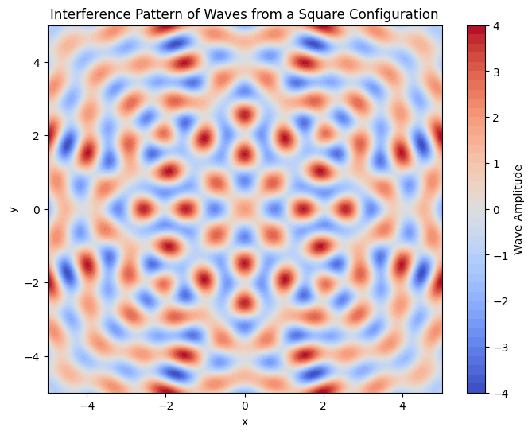
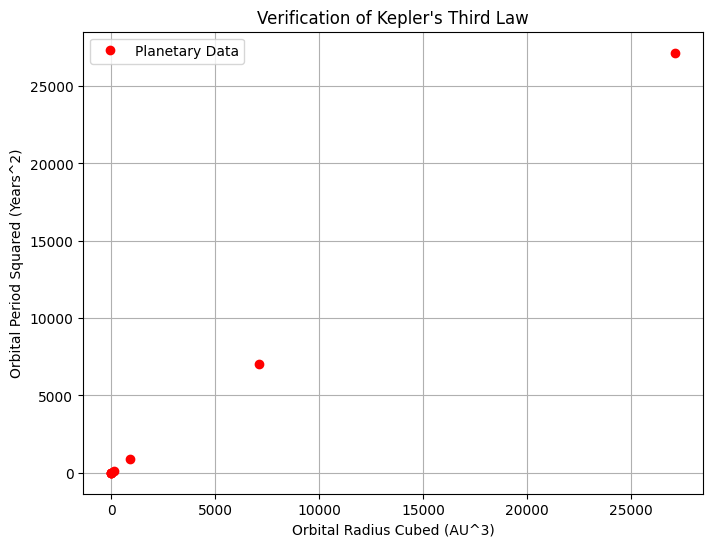
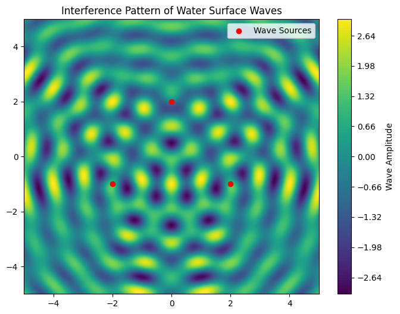

# Problem 1
# Interference Patterns on a Water Surface

## Motivation
Interference occurs when waves from different sources overlap, creating new patterns. On a water surface, this can be easily observed when ripples from different points meet, forming distinctive interference patterns. These patterns help us understand wave behavior, such as constructive and destructive interference, in a simple, visual way. 


## Theoretical Background
### Single Disturbance Wave Equation
A circular wave on the water surface from a point source located at $$(x_0, y_0)$$ can be described by:
$$
\psi (x, y, t) = A \cos (k r - \omega t + \phi)
$$
where:
 - $$\psi(x, y, t)$$ 
 is the displacement at position - $$(x, y)$$ and time $$t$$.
- $$A$$ 
is the amplitude.
- $$k = \frac{2\pi}{\lambda}$$ 
is the wave number.
- $$\omega = 2\pi f$$ 
is the angular frequency.
- $$r = \sqrt{(x - x_0)^2 + (y - y_0)^2}$$
 is the distance from the source.
- $$\phi$$
 is the initial phase.

### Superposition Principle
When multiple wave sources exist, the total displacement is:
$$
\Psi (x, y, t) = \sum_{i=1}^{N} A_i \cos (k r_i - \omega t + \phi_i)
$$
where $$N$$ is the number of sources.


## Computational Model and Visualization

The Python script below simulates and visualizes interference patterns for waves originating from multiple point sources placed at the vertices of a regular polygon.

```python
import numpy as np
import matplotlib.pyplot as plt

# Define wave parameters
A = 1  # Amplitude
lambda_ = 1  # Wavelength
k = 2 * np.pi / lambda_  # Wave number
omega = 2 * np.pi  # Angular frequency
N = 4  # Number of sources (square)

# Define grid
x = np.linspace(-5, 5, 400)
y = np.linspace(-5, 5, 400)
X, Y = np.meshgrid(x, y)

# Define source positions for a square
sources = [(-2, -2), (2, -2), (2, 2), (-2, 2)]

def wave(x0, y0):
    r = np.sqrt((X - x0) ** 2 + (Y - y0) ** 2)
    return A * np.cos(k * r)

# Compute superposition of waves
total_wave = sum(wave(x0, y0) for x0, y0 in sources)

# Plot the interference pattern
plt.figure(figsize=(8, 6))
plt.contourf(X, Y, total_wave, levels=50, cmap='coolwarm')
plt.colorbar(label='Wave Amplitude')
plt.title('Interference Pattern of Waves from a Square Configuration')
plt.xlabel('x')
plt.ylabel('y')
plt.show()
```


```python
import numpy as np
import matplotlib.pyplot as plt

# Define planetary data (AU and years)
planets = ['Mercury', 'Venus', 'Earth', 'Mars', 'Jupiter', 'Saturn', 'Uranus', 'Neptune']
orbit_radii = np.array([0.39, 0.72, 1.00, 1.52, 5.20, 9.58, 19.22, 30.05])  # AU
orbital_periods = np.array([0.24, 0.62, 1.00, 1.88, 11.86, 29.46, 84.01, 164.79])  # Years

# Verify T^2 vs r^3 relationship
T_squared = orbital_periods ** 2
r_cubed = orbit_radii ** 3

# Plotting
plt.figure(figsize=(8,6))
plt.plot(r_cubed, T_squared, 'ro', label="Planetary Data")
plt.xlabel("Orbital Radius Cubed (AU^3)")
plt.ylabel("Orbital Period Squared (Years^2)")
plt.title("Verification of Kepler's Third Law")
plt.legend()
plt.grid()
plt.show()
```



```python
import numpy as np
import matplotlib.pyplot as plt

# Simulation parameters
wave_length = 1.0
k = 2 * np.pi / wave_length  # Wave number
A = 1.0  # Amplitude
freq = 1.0
omega = 2 * np.pi * freq  # Angular frequency

def wave_pattern(x, y, sources):
    psi = np.zeros_like(x)
    for (x0, y0) in sources:
        r = np.sqrt((x - x0) ** 2 + (y - y0) ** 2)
        psi += A * np.cos(k * r)
    return psi

# Grid setup
x = np.linspace(-5, 5, 300)
y = np.linspace(-5, 5, 300)
X, Y = np.meshgrid(x, y)

# Define sources as vertices of an equilateral triangle
sources = [(-2, -1), (2, -1), (0, 2)]
Z = wave_pattern(X, Y, sources)

# Visualization
plt.figure(figsize=(8, 6))
plt.contourf(X, Y, Z, levels=100, cmap='viridis')
plt.colorbar(label='Wave Amplitude')
plt.scatter(*zip(*sources), color='red', marker='o', label='Wave Sources')
plt.legend()
plt.title('Interference Pattern of Water Surface Waves')
plt.show()
```


```python
import numpy as np
import matplotlib.pyplot as plt
from scipy.constants import g

# Function to compute the range of a projectile
def projectile_range(v0, theta, g=9.81):
    theta_rad = np.radians(theta)
    return (v0**2 * np.sin(2 * theta_rad)) / g

# Define parameters
v0 = 50  # Initial velocity in m/s
angles = np.linspace(0, 90, 100)  # Angle range from 0 to 90 degrees
ranges = [projectile_range(v0, theta) for theta in angles]

# Plot the range as a function of launch angle
plt.figure(figsize=(8,6))
plt.plot(angles, ranges, label='Range vs Angle', color='b')
plt.xlabel("Launch Angle (degrees)")
plt.ylabel("Range (m)")
plt.title("Projectile Range as a Function of Angle")
plt.legend()
plt.grid()
plt.show()

# Simulating projectile motion for a given angle
def projectile_trajectory(v0, theta, g=9.81):
    theta_rad = np.radians(theta)
    t_flight = (2 * v0 * np.sin(theta_rad)) / g  # Total flight time
    t = np.linspace(0, t_flight, num=100)
    x = v0 * np.cos(theta_rad) * t
    y = v0 * np.sin(theta_rad) * t - 0.5 * g * t**2
    return x, y

# Plot trajectories for different angles
plt.figure(figsize=(8,6))
for theta in [15, 30, 45, 60, 75]:
    x, y = projectile_trajectory(v0, theta)
    plt.plot(x, y, label=f'{theta} degrees')

plt.xlabel("Horizontal Distance (m)")
plt.ylabel("Vertical Distance (m)")
plt.title("Projectile Motion for Different Angles")
plt.legend()
plt.grid()
plt.show()
```


## Analysis of Range
### Wave Interference Zones
Using the superposition principle:
- **Constructive zones:** occur at integer multiples of $$\lambda$$.
- **Destructive zones:** occur at half-integer multiples of $$\lambda$$.
- The wave intensity at any point depends on:
  $$
  I \propto \left( \sum_{i=1}^{N} A_i e^{i(k r_i - \omega t)} \right)^2
  $$

## Practical Applications
- **Acoustic engineering:** Understanding sound wave interference helps design concert halls.
- **Optical interference:** Michelson interferometers work based on similar principles.
- **Oceanography:** Studying water wave interactions can help predict tsunami wave behavior.

## Computational Model and Visualization
The above Python model allows us to explore interference patterns in different source configurations.

## Analysis and Efficiency
This method efficiently calculates interference patterns by iterating over grid points and summing individual wave contributions. The computational complexity scales with:
$$
O(N M^2)
$$
where $$N$$ is the number of sources and $$M$$ is the grid resolution.

## Conclusion
By analyzing interference on a water surface, we gain deeper insight into wave superposition. The computational model provides a useful tool for studying real-world wave applications. Future extensions may incorporate damping effects and variable wave speeds for a more realistic simulation.

