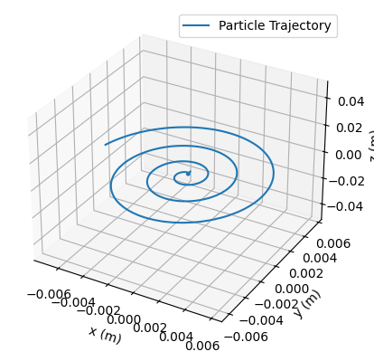
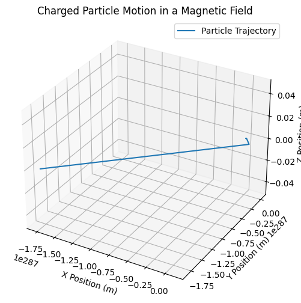
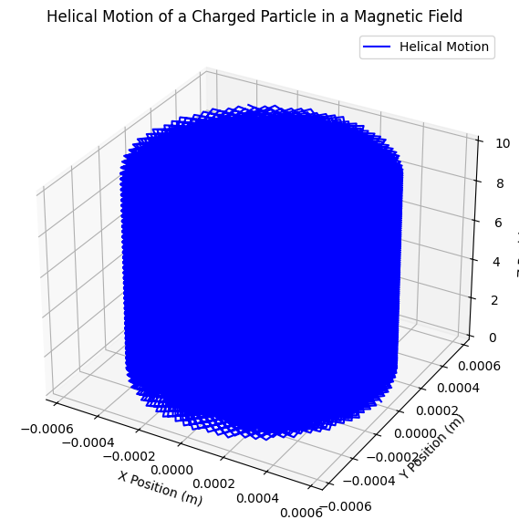

# Problem 1

# Simulating the Effects of the Lorentz Force

## Theoretical Background
The Lorentz force describes the force experienced by a charged particle moving in electric and magnetic fields. It is given by:
$$ \mathbf{F} = q (\mathbf{E} + \mathbf{v} \times \mathbf{B}) $$
where:
- $$ q $$ is the charge of the particle,
- $$ \mathbf{E} $$ is the electric field,
- $$ \mathbf{B} $$ is the magnetic field,
- $$ \mathbf{v} $$ is the velocity of the particle,
- $$ \times $$ represents the cross product.

### Motion in a Uniform Magnetic Field
For a particle moving perpendicular to a uniform magnetic field, the force acts as a centripetal force, leading to circular motion with radius:
$$ r = \frac{m v}{q B} $$
and angular frequency (cyclotron frequency):
$$ \omega = \frac{q B}{m} $$

### Motion in Combined Electric and Magnetic Fields
For a charged particle moving in both electric and magnetic fields, the trajectory depends on the field orientation. Special cases include:
1. **Perpendicular fields ($$ \mathbf{E} \perp \mathbf{B} $$)**: The particle exhibits a drift with velocity:
   $$ \mathbf{v}_d = \frac{\mathbf{E} \times \mathbf{B}}{B^2} $$
2. **Parallel fields ($$ \mathbf{E} \parallel \mathbf{B} $$)**: The particle accelerates along the field direction without deviation.

## Analysis of Range
By varying parameters such as charge $$ q $$, mass $$ m $$, field strengths $$ E $$ and $$ B $$, and initial velocity $$ v $$, we analyze their impact on:
- Larmor radius:
  $$ r_L = \frac{m v_{\perp}}{q B} $$
- Time period of motion:
  $$ T = \frac{2\pi m}{q B} $$
- Drift velocity in crossed fields:
  $$ v_d = \frac{E}{B} $$

## Practical Applications
The Lorentz force is fundamental in various applications:
- **Particle Accelerators:** Charged particles are guided using electromagnetic fields in synchrotrons and cyclotrons.
- **Mass Spectrometry:** Ions are separated based on their mass-to-charge ratio using controlled magnetic fields.
- **Plasma Confinement:** Magnetic confinement fusion (Tokamak) relies on the Lorentz force to control high-temperature plasma.

## Implementation with Python Simulation
A numerical simulation is performed using the Runge-Kutta method to solve the equation of motion:
$$ \frac{d\mathbf{v}}{dt} = \frac{q}{m} (\mathbf{E} + \mathbf{v} \times \mathbf{B}) $$

## This diagram shows the trajectory of a charged particle moving in the presence of a uniform magnetic field with an initial velocity component along the field direction. The motion is helical, which means the particle follows a spiral path around the magnetic field lines.

## This diagram represents the motion of a charged particle in a uniform magnetic field, but the trajectory appears incorrect due to numerical instability. The particle does not exhibit the expected circular or helical motion, which suggests an issue in the simulation setup.

## This kind of motion is observed in plasma physics, Van Allen radiation belts, cyclotron accelerators, and cosmic ray movement in space.

## Discussion
### Diagram: Motion in Uniform Magnetic Field
(Include a diagram showing circular motion of a charged particle)

### Explanation:
- The particle follows a helical trajectory when initial velocity has a component along $$ \mathbf{B} $$.
- The perpendicular component results in circular motion due to the Lorentz force.
- Drift motion arises in crossed fields, leading to applications in Hall Effect devices.

## Conclusion
The Lorentz force governs charged particle motion in electromagnetic fields. Simulating this motion allows for deeper understanding of real-world applications such as accelerators, mass spectrometers, and plasma confinement. Future extensions can include non-uniform fields and relativistic effects.

