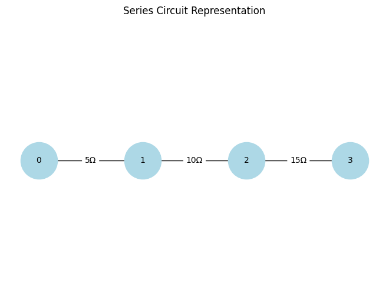
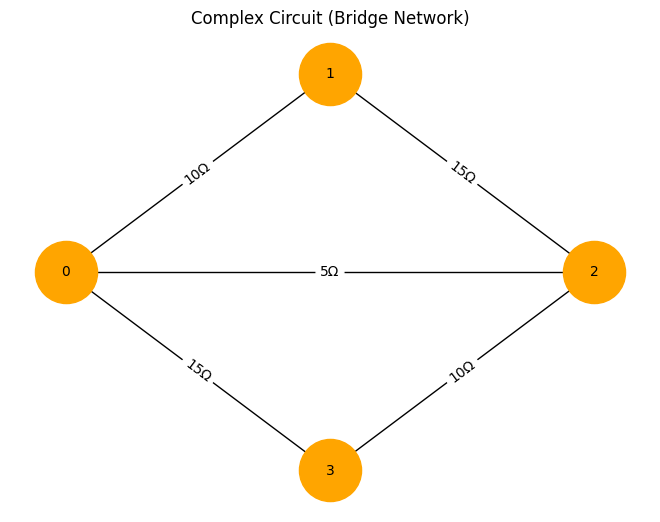
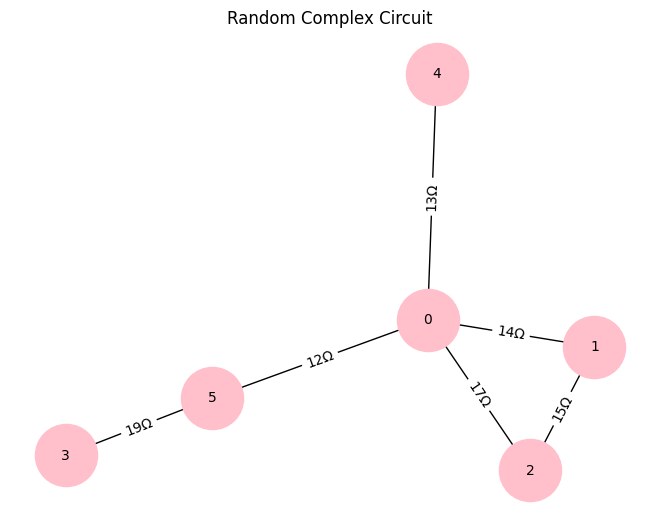

# Problem 1
### **Equivalent Resistance Using Graph Theory**  
 
#### **Motivation**  
Electrical circuits consist of resistors arranged in **series, parallel, or mixed configurations**. Calculating the **equivalent resistance** helps determine how a circuit behaves electrically, which is crucial in designing **efficient electrical networks**.  
 
Traditionally, circuits are analyzed using **Ohm’s Law** and **Kirchhoff’s Rules**, but **graph theory** offers a **systematic and automated** approach. Representing a circuit as a **graph** allows for efficient **reduction of resistors** using algorithms, making it useful in circuit simulation, optimization, and large-scale network analysis.  
 
---
 
### **Graph Theory Approach to Circuit Analysis**  
 
A circuit can be represented as a **graph**, where:  
- **Nodes (vertices)** represent circuit junctions.  
- **Edges** represent resistors with weights equal to their resistance values.  
- **Graph reductions** simplify complex resistor networks step by step.  
 
---
 
### **Types of Resistor Combinations**  
 
#### **1. Series Combination**  
- Resistors connected end-to-end.  
- **Graph representation**: A direct path between two nodes.  
- **Formula**:  
  $$\[
  R_{\text{eq}} = R_1 + R_2 + \dots + R_n
  \]$$
 
📌 **Graph Reduction**: Merge nodes into a single edge with summed resistance.  
 
#### **2. Parallel Combination**  
- Resistors share the same two nodes.  
- **Graph representation**: Multiple edges between the same pair of nodes.  
- **Formula**:  
  $$\[
  \frac{1}{R_{\text{eq}}} = \frac{1}{R_1} + \frac{1}{R_2} + \dots + \frac{1}{R_n}
  \]$$
 
📌 **Graph Reduction**: Replace multiple edges with a single edge of equivalent resistance.  
 
#### **3. Complex Networks (Bridges, Loops, etc.)**  
- Circuits with **mixed connections** or **cycles** (e.g., Wheatstone Bridge).  
- **Graph representation**: **Cycles** in the circuit graph.  
- **Solution Methods**:  
  - **Graph traversal (DFS/BFS)** to detect connectivity.  
  - **Transformations** to reduce components.  
  - **Numerical methods** (e.g., Kirchhoff’s Laws, Mesh Analysis).  
 
---
 
### **Algorithm for Calculating Equivalent Resistance Using Graph Theory**  
 
#### **Step 1: Construct Graph Representation**  
- **Nodes** = Junctions in the circuit.  
- **Edges** = Resistors (weighted by resistance value).  
 
#### **Step 2: Identify and Reduce Series Resistors**  
- Use **graph traversal (DFS/BFS)** to detect **linear chains** of resistors.  
- Replace series resistors with a **single equivalent resistor**.  
 
#### **Step 3: Identify and Reduce Parallel Resistors**  
- Detect **multiple edges** between the same pair of nodes.  
- Replace them with a **single equivalent resistor** using the parallel formula.  
 
#### **Step 4: Handle Complex Circuits (Loops, Bridges, etc.)**  
- Use **Kirchhoff’s Laws or Numerical Methods** for cycles.  
- Reduce **step by step** until only two nodes remain.  
 
#### **Step 5: Output the Final Equivalent Resistance**  
 
---
 
### **Example Cases**  
 
#### **Example 1: Simple Series Circuit**  
📌 **Graph Representation:**  
- Nodes: **A → B → C**  
- Edges: **A-B (5Ω), B-C (10Ω)**  
📌 **Reduction:**  

#### **Example 2: Parallel Circuit**  
📌 **Graph Representation:**  
- Nodes: **A, B**  
- Edges: **A-B (5Ω), A-B (10Ω)**  
📌 **Reduction:**  

 
#### **Example 3: Complex Circuit (Wheatstone Bridge)**  
📌 **Graph Representation:**  
- **5 Nodes**, **6 Edges**  
- Requires **Graph Reduction + Kirchhoff’s Laws**.  

---
 
---
 
### **Conclusion**  
Graph theory provides an **efficient and structured** way to **analyze circuits**, making it ideal for **large and complex networks**. This approach enables automation, making it useful for both **theoretical studies and real-world circuit design**.
