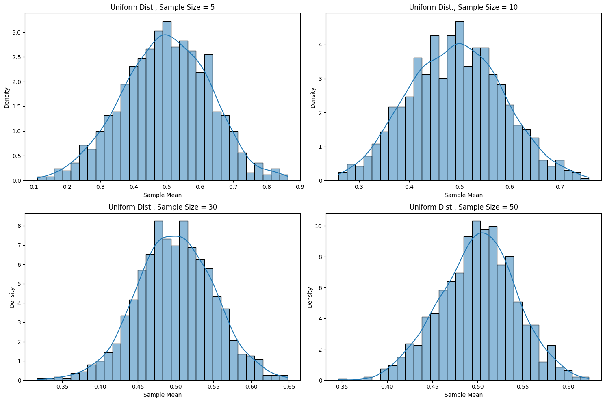
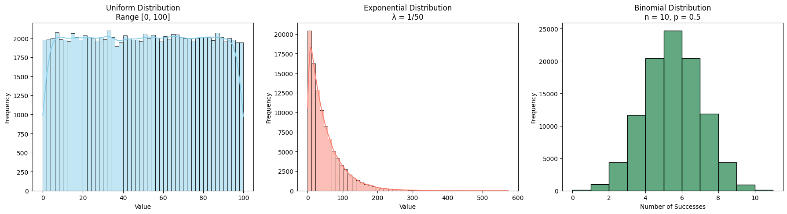
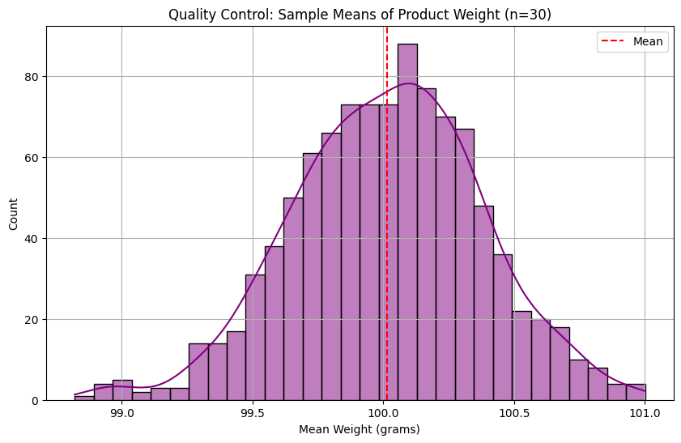

# Central Limit Theorem: Simulation-Based Exploration

---

## Theoretical Foundation

The **Central Limit Theorem (CLT)** states that, given a sufficiently large sample size, the sampling distribution of the mean of any independent random variable will be approximately normally distributed, regardless of the variable's original distribution.

### Key Formula:

If \$X\_1, X\_2, \dots, X\_n\$ are independent and identically distributed (i.i.d.) random variables with mean \$\mu\$ and variance \$\sigma^2\$, then the sample mean:

$$
\bar{X}_n = \frac{1}{n} \sum_{i=1}^{n} X_i
$$

has an approximate normal distribution:

$$
\bar{X}_n \sim \mathcal{N}\left(\mu, \frac{\sigma^2}{n}\right) \quad \text{as } n \to \infty
$$

---

## Analysis of Range

We explore the following distributions:

### 1. Uniform Distribution \$\sim \mathcal{U}(a, b)\$

* Mean: $\mu = \frac{a + b}{2}$
* Variance: $\sigma^2 = \frac{(b - a)^2}{12}$

### 2. Exponential Distribution \$\sim \text{Exp}(\lambda)\$

* Mean: $\mu = \frac{1}{\lambda}$
* Variance: $\sigma^2 = \frac{1}{\lambda^2}$

### 3. Binomial Distribution \$\sim \text{Bin}(n, p)\$

* Mean: $\mu = np$
* Variance: $\sigma^2 = np(1 - p)$

As \$n\$ increases, the sample mean distribution approaches:

$$
\bar{X}_n \approx \mathcal{N}(\mu, \frac{\sigma^2}{n})
$$

---

## Practical Applications

* **Statistical inference**: Confidence intervals and hypothesis tests rely on normal approximations.
* **Quality control**: Monitoring product variation via sample averages.
* **Economics & finance**: Portfolio returns modeled via CLT for large \$n\$.

---

## Implementation with Python Simulation

## 1. Simulating Sampling Distributions
🔢 Objective:
Simulate three types of populations to explore how their shapes influence the behavior of sample means in the Central Limit Theorem (CLT).

##  Python Code: CLT in Quality Control

Diagram Explanation:

- The histogram shows the distribution of the means of 1000 random samples, each with 30 product weights.

- The red dashed line represents the average of these sample means (≈ population mean).

- The bell-shaped curve demonstrates that sample means approximate a normal distribution, validating the Central Limit Theorem.

## Discussion and Diagrams

### Diagram 1: Uniform Distribution CLT Convergence

Shows histograms of sample means from a uniform $\[0,1]\$ distribution as sample size increases.

* **Explanation**: Even though the uniform distribution is flat, the sample mean distribution becomes bell-shaped due to CLT.

### Diagram 2: Exponential Distribution CLT Convergence

Demonstrates convergence from a right-skewed exponential distribution.

* **Explanation**: Despite the asymmetry of the original distribution, the sampling distribution of the mean becomes symmetric.

### Diagram 3: Binomial Distribution CLT Convergence

Illustrates how the discrete binomial distribution's sample mean approaches normality.

* **Explanation**: With increasing samples, discrete distributions yield smooth, approximately normal sample mean distributions.

---

## Conclusion

* The CLT holds for all tested distributions regardless of their shape.
* As sample size \$n\$ increases, the sample mean distribution converges to a normal distribution with mean \$\mu\$ and variance \$\sigma^2/n\$.
* Practical experiments confirm theoretical expectations, reinforcing the foundational importance of the CLT in statistical analysis.

