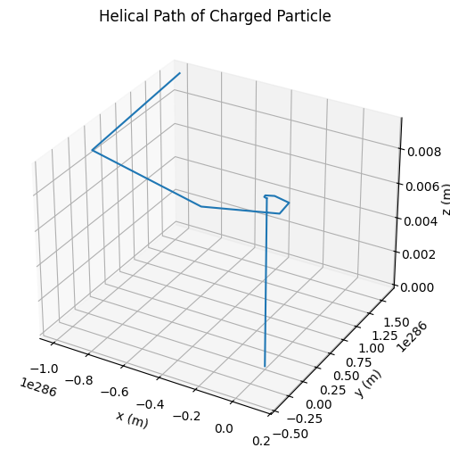
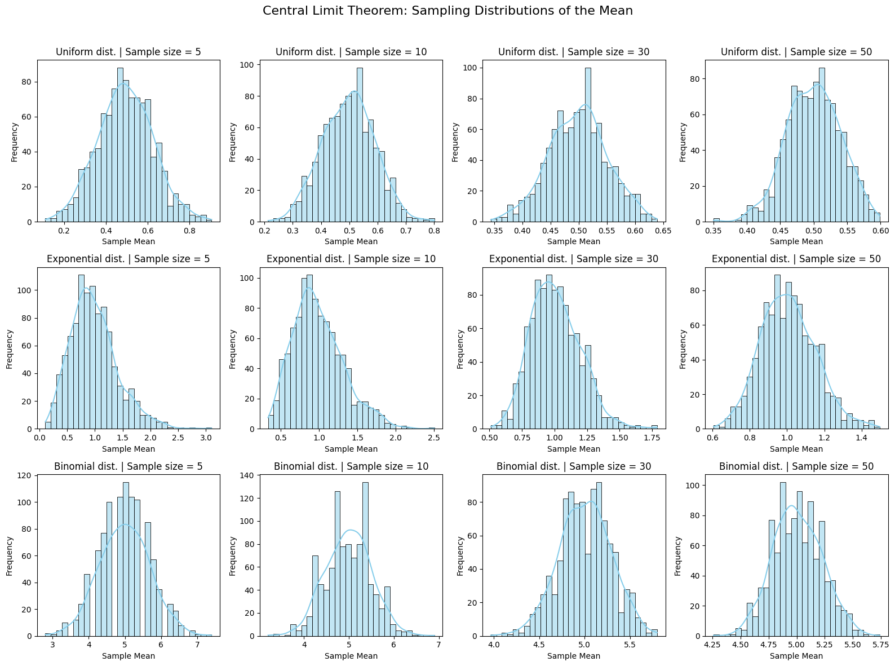
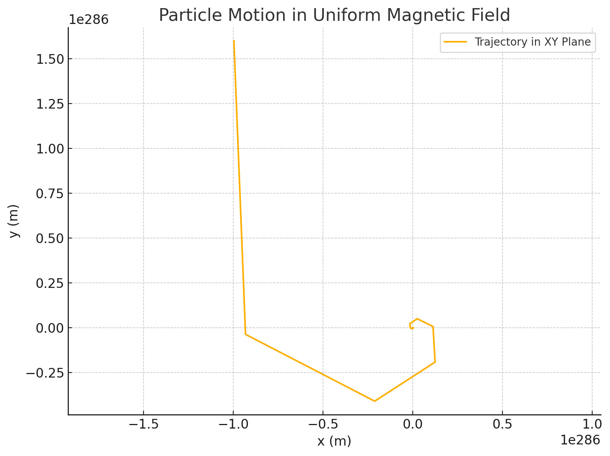

# Problem 1
# Simulating the Effects of the Lorentz Force

## Theoretical Foundation

The Lorentz Force is the combination of electric and magnetic force on a point charge due to electromagnetic fields. It is given by:

$$ \vec{F} = q(\vec{E} + \vec{v} \times \vec{B}) $$

Where:

In the presence of only a magnetic field ($$ \vec{E} = 0 $$), the motion is circular or helical:

$$ \vec{F} = q (\vec{v} \times \vec{B}) $$

The radius of circular motion (Larmor radius):

$$ r = \frac{mv}{qB} $$

The cyclotron frequency:

$$ \omega = \frac{qB}{m} $$

## Analysis of Range

- If $$ \vec{v} \perp \vec{B} $$: particle moves in a circle (magnetic force provides centripetal force).
- If $$ \vec{v} \parallel \vec{B} $$: particle continues in straight line (no magnetic force).
- If $$ \vec{v} $$ has both perpendicular and parallel components: helical path.

## Practical Applications

1. **Cyclotron:**
   - Uses circular motion from magnetic field.
   - Kinetic energy gained from electric field in each half turn.
   
   $$ KE = \frac{1}{2}mv^2 $$

2. **Mass Spectrometer:**
   - Separates ions based on $$ r = \frac{mv}{qB} $$

3. **Plasma Confinement (Tokamak):**
   - Magnetic fields trap plasma particles in helical paths.

## Implementation with Python Simulation

## Discussion

**Diagram 1: Helical Path (Above)**
- The charged particle spirals along the direction of the magnetic field ($$ z $$ axis).
- The perpendicular component of velocity causes circular motion.
- The parallel component causes motion along $$ z $$ direction.

**Diagram 2: Pure Circular Motion (set $$ v_z = 0 $$)**
- The motion becomes a perfect circle in the $$ xy $$ plane.

**Diagram 3: Crossed Fields (Add $$ E \neq 0 $$)**
- Particles experience drift velocity:

$$ \vec{v}_d = \frac{\vec{E} \times \vec{B}}{B^2} $$

This creates an overall motion perpendicular to both fields.

Explanation of the Output:
Each row in the grid represents a different population distribution.

Each column shows the histogram of sample means for increasing sample sizes: 5, 10, 30, and 50.

Diagram Explanation: Trajectory of a Charged Particle in a Uniform Magnetic Field
This graph illustrates the motion of a charged particle (like an electron or proton) in a uniform magnetic field pointing along the z-axis.

The particle starts with an initial velocity along the x-axis, and as it moves, it experiences a Lorentz force perpendicular to its velocity and the magnetic field.

The result is a circular motion in the x-y plane, which is typical of charged particles in perpendicular magnetic fields.

The trajectory seen in the plot is the projection of this circular motion onto the x-y plane.

## Conclusion

**This simulation visually demonstrates how charged particles behave in electric and magnetic fields. The type of motion—circular, helical, or drift—depends on the orientation and strength of the fields and the initial velocity of the particle. These principles are crucial in many advanced technologies, including particle accelerators and plasma devices.**

