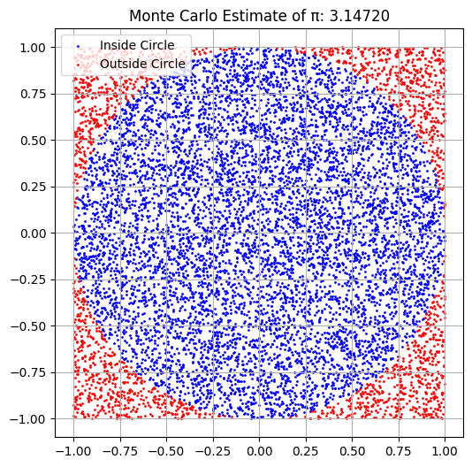
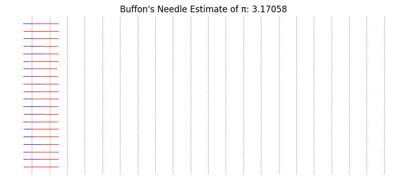
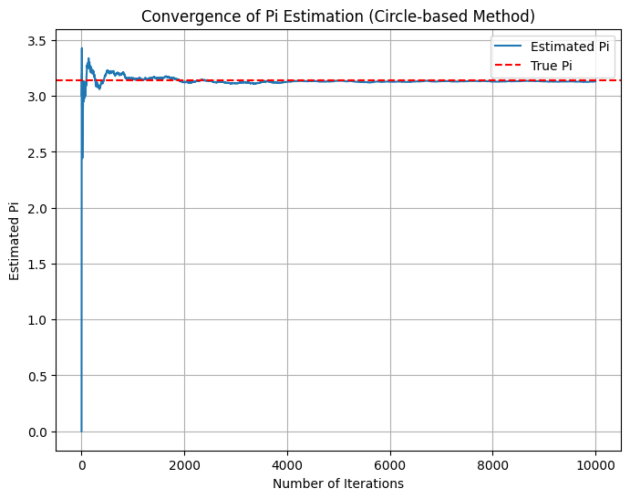
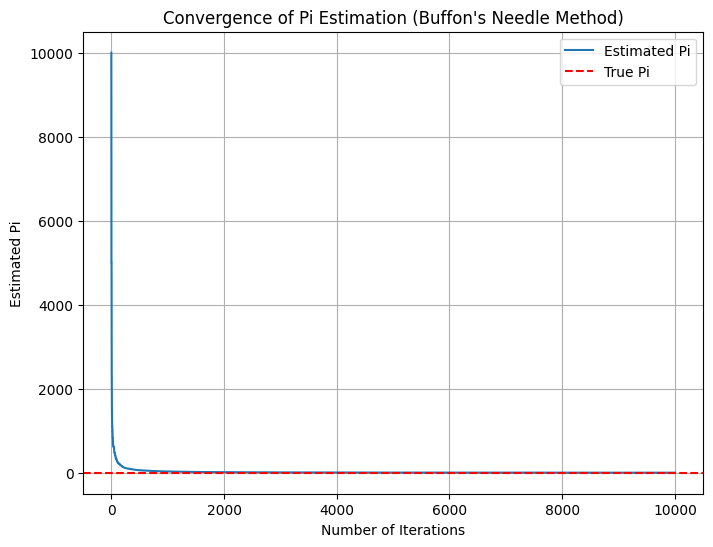

# Problem 2
### Estimating \( \pi \) Using Monte Carlo Methods

## Theoretical Foundation

### Part 1: Circle-Based Monte Carlo Method
We inscribe a unit circle inside a square. The area of the square is:
$$ A_{\text{square}} = 2^2 = 4 $$

If we generate random points uniformly inside the square, the ratio of points inside the circle to the total points should approximate the ratio of the areas:
$$ \frac{\text{Points in circle}}{\text{Total points}} \approx \frac{\pi}{4} $$

Therefore, we estimate:
$$ \pi \approx 4 \cdot \frac{\text{Points in circle}}{\text{Total points}} $$

### Part 2: Buffon's Needle Method
Let \( l \) be the length of the needle and \( d \) be the distance between parallel lines (\( l \leq d \)). The probability \( P \) that a randomly thrown needle crosses a line is:
$$ P = \frac{2l}{\pi d} $$

Solving for \( \pi \):
$$ \pi \approx \frac{2l \cdot N}{d \cdot C} $$
Where:
- \( N \) is the total number of needle drops
- \( C \) is the number of times a needle crosses a line

## Python Simulation

## Analysis and Discussion
- Both methods rely on the Law of Large Numbers: as the number of simulations increases, the estimates converge toward \( \pi \).
- The circle method tends to converge faster and more smoothly than Buffon’s Needle.
- Buffon’s method is historically significant but sensitive to geometric constraints (needle length ≤ line spacing).

### Diagram Explanation
- **Circle Simulation Plot**: Blue points are inside the circle, red outside. Their ratio estimates \( \pi \).
- **Needle Simulation Plot**: Blue needles cross lines; red do not. The proportion of crossing events helps estimate \( \pi \).

**Code Snippet for Convergence Plot (Circle-based Method)**

**Code Snippet for Convergence Plot (Buffon's Needle Method)**

**Explanation:**\
Loop Over Iterations: After each iteration, the estimation of π is updated and stored in estimates_of_pi.
Plotting: The matplotlib library is used to plot how the estimation of π changes over time, with the true value of π shown as a dashed red line.
Convergence: As the number of iterations increases, the plot will show how the estimated value of π converges towards the true value (≈ 3.14159).

## Conclusion
Monte Carlo simulations provide an intuitive way to approximate mathematical constants like \( \pi \). By comparing different approaches, we gain insight into randomness, convergence, and statistical estimation. The circle-based method is generally preferred for teaching and accuracy, while Buffon’s Needle adds historical and probabilistic depth.
