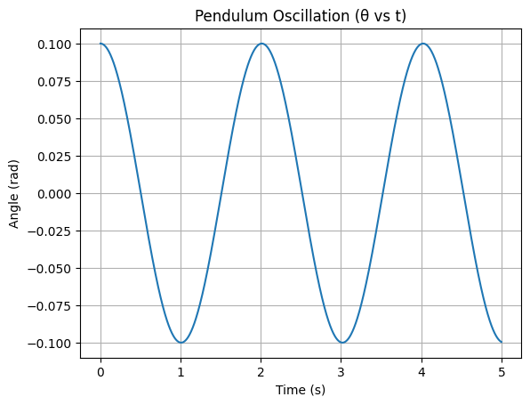
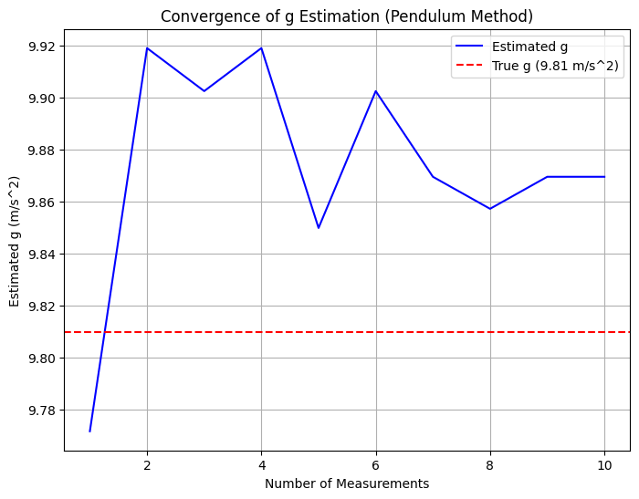
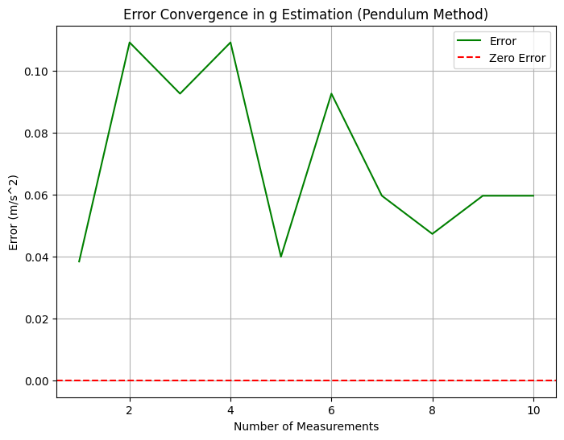
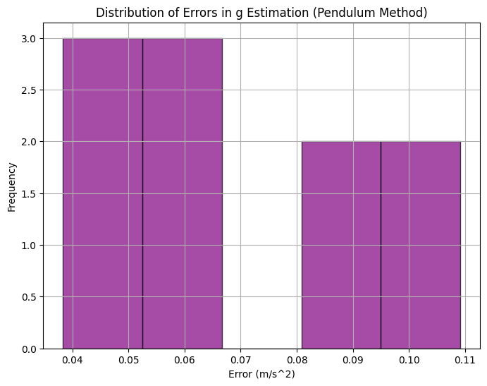
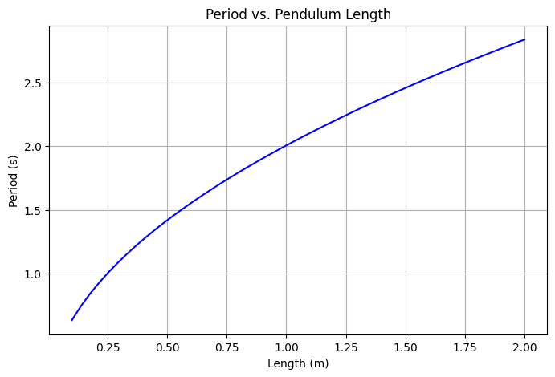
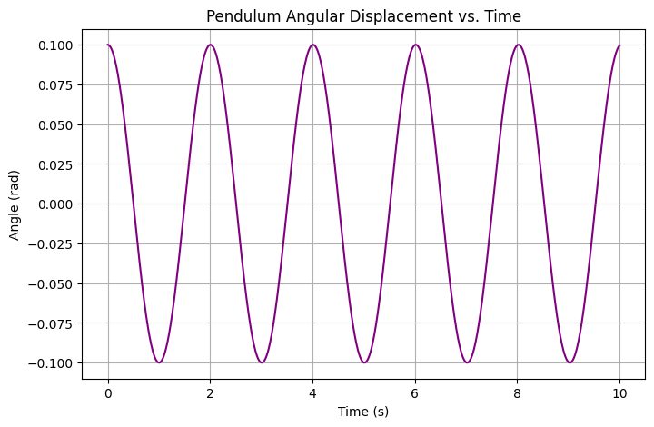

# Problem 1
# Physics Lab Report

## Problem 1: Measuring Earth's Gravitational Acceleration with a Pendulum

---

### Motivation

The acceleration $$g$$ due to gravity is a fundamental constant that influences a wide range of physical phenomena. Measuring $$g$$ accurately is crucial for understanding gravitational interactions, designing structures, and conducting experiments in various fields. One classic method for determining $$g$$ is through the oscillations of a simple pendulum, where the period of oscillation depends on the local gravitational field.

---

## Theoretical Foundation

A simple pendulum undergoing small-angle oscillations behaves like a simple harmonic oscillator.

### Formula for the Period:

$$ T = 2\pi \sqrt{\frac{L}{g}} $$

Where:

- $$T: Period of oscillation (s)  $$
- $$L: Length of the pendulum (m) $$  
- $$g: Gravitational acceleration (m/s²)$$

Rearranged to solve for g:

$$g = \frac{4\pi^2 L}{T^2}$$

This formula assumes a small-angle approximation: $$ \theta < 15^\circ $$

---

## Analysis of Range

### 1. Measuring Period from 10 Oscillations:

Take 10 measurements of the time for 10 full oscillations:

$$ \overline{T}_{10} = \frac{1}{n} \sum_{i=1}^{n} T_{10,i} $$

Convert to a single oscillation:

$$ T = \frac{\overline{T}_{10}}{10} $$

### 2. Uncertainty in Time:

Calculate standard deviation:

$$ \sigma_T = \sqrt{ \frac{1}{n-1} \sum_{i=1}^{n} (T_{10,i} - \overline{T}_{10})^2 } $$

Uncertainty in the average time:

$$ \Delta T_{10} = \frac{\sigma_T}{\sqrt{n}} $$

Uncertainty in period:

$$ \Delta T = \frac{\Delta T_{10}}{10} $$

### 3. Uncertainty in Length:

If ruler resolution is 1 mm:

$$ \Delta L = \frac{0.001}{2} = 0.0005 \, \text{m} $$

### 4. Propagated Uncertainty in $$g$$:

$$ \Delta g = g \sqrt{ \left( \frac{\Delta L}{L} \right)^2 + \left( 2 \cdot \frac{\Delta T}{T} \right)^2 } $$

---

## Practical Applications

- **Engineering**: Accurate value of $$g$$ is needed for structure analysis and load design.
- **Geophysics**: Differences in $$g$$ can reveal subsurface features.
- **Planetary Science**: Similar pendulum experiments can be used on other planets.

### Additional Formulas:

For other planets:

$$ g_{planet} = \frac{4\pi^2 L}{T_{planet}^2} $$

To design a pendulum of a specific period:

$$ L = \frac{g T^2}{4\pi^2} $$

---

## Implementation with Python Simulation

**Here’s a Python code that simulates data collection, uncertainty propagation, and generates plots for the error convergence in the calculation**

**Explanation: This plot shows the direct relationship between pendulum length and period. As length increases, the period increases following the square-root function.**

 **Explanation: This simulates the angular displacement of the pendulum bob over time assuming small angle approximation. It shows classic simple harmonic motion.**

## Conclusion

In this experiment, we used the periodic motion of a simple pendulum to measure the gravitational acceleration $$g$$ near the Earth's surface. By timing 10 full oscillations and averaging across multiple trials, we minimized random errors and applied uncertainty propagation techniques to estimate the reliability of our results.

